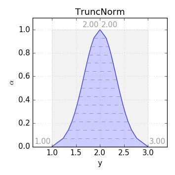
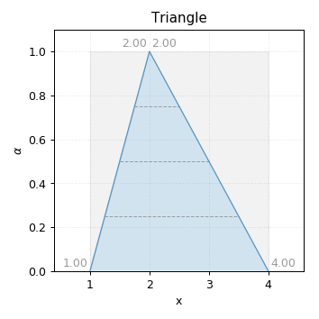
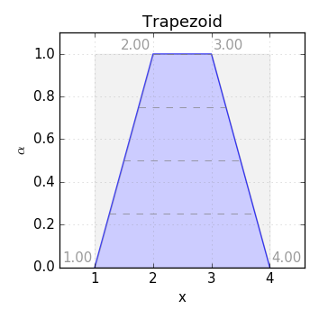
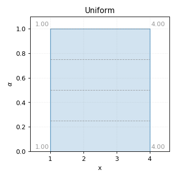
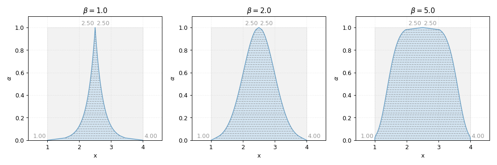
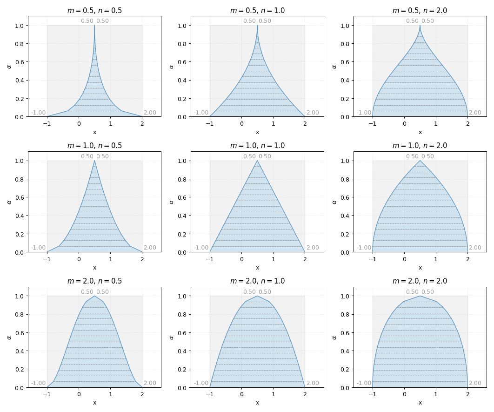
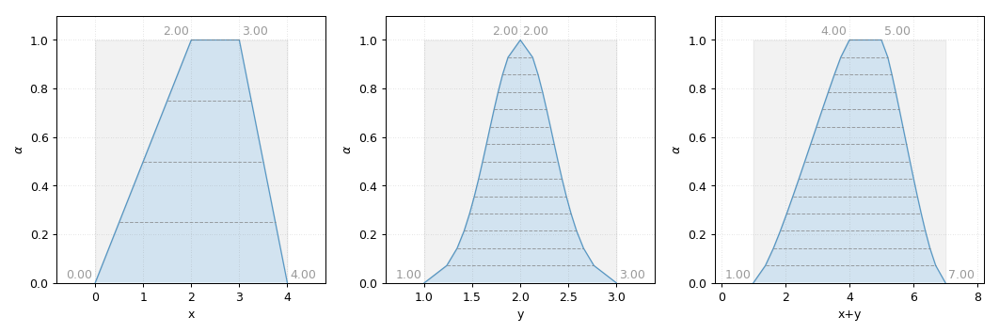
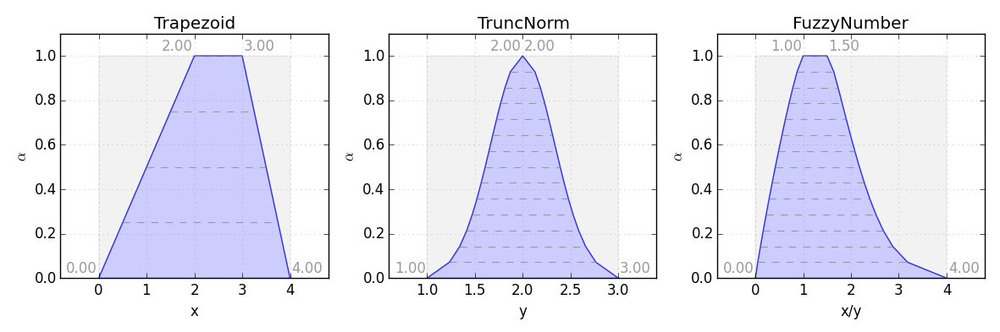

---

# phuzzy

fuzzy membership function

---

## Design goals

* python representation of fuzzy numbers|data
* specify uncertainty easily

---

## phuzzy.Triangle

    p = phuzzy.Triangle(alpha0=[1,4], alpha1=[2],
                        number_of_alpha_levels=5)

+++

## phuzzy.Triangle

    p = phuzzy.Triangle(alpha0=[1,4], alpha1=[2],
                        number_of_alpha_levels=5)

    p.df

       alpha     l    r
    0   0.00  1.00  4.0
    1   0.25  1.25  3.5
    2   0.50  1.50  3.0
    3   0.75  1.75  2.5
    4   1.00  2.00  2.0

---

## phuzzy.Trapezoid

    p = phuzzy.Trapezoid(alpha0=[1,4], alpha1=[2,3],
                         number_of_alpha_levels=5)

+++

## phuzzy.Trapezoid

    p = phuzzy.Trapezoid(alpha0=[1,4], alpha1=[2,3],
                         number_of_alpha_levels=5)

    p.df

       alpha     l     r
    0   0.00  1.00  4.00
    1   0.25  1.25  3.75
    2   0.50  1.50  3.50
    3   0.75  1.75  3.25
    4   1.00  2.00  3.00

---

## phuzzy.Uniform

    p = phuzzy.Uniform(alpha0=[1,4]
                         number_of_alpha_levels=5)

+++

## phuzzy.Uniform

    p = phuzzy.Trapezoid(alpha0=[1,4],
                         number_of_alpha_levels=5)

    p.df

       alpha     l     r
    0   0.00  1.00  4.00
    1   0.25  1.00  4.00
    2   0.50  1.00  4.00
    3   0.75  1.00  4.00
    4   1.00  1.00  4.00

---

## phuzzy.TruncNorm

    p = phuzzy.TruncNorm(alpha0=[1,3],
                         number_of_alpha_levels=15, name="y")

+++

## phuzzy.TruncNorm

    p = phuzzy.TruncNorm(alpha0=[1,3],
                         number_of_alpha_levels=15, name="y")

    p.df

           alpha         l         r
    0   0.000000  1.000000  3.000000
    1   0.071429  1.234184  2.765816
    2   0.142857  1.342402  2.657598
    3   0.214286  1.414912  2.585088
    4   0.285714  1.472370  2.527630
    5   0.357143  1.521661  2.478339
    6   0.428571  1.566075  2.433925
    7   0.500000  1.607529  2.392471
    8   0.571429  1.647354  2.352646
    9   0.642857  1.686656  2.313344
    10  0.714286  1.726558  2.273442
    11  0.785714  1.768503  2.231497
    12  0.857143  1.814923  2.185077
    13  0.928571  1.871675  2.128325
    14  1.000000  2.000000  2.000000

---

## phuzzy.TruncGenNorm

    p = phuzzy.TruncGenNorm(alpha0=[1,3],
                         number_of_alpha_levels=15, name="y",
                         beta=5)

---

## phuzzy.Superellipse

    p = phuzzy.Superellipse(alpha0=[1,3],
                         number_of_alpha_levels=15, name="y",
                         m=2, n=.5)

---

## x+y

+++

## x-y

+++

## x*y

+++

## x:y

+++

## x^y

---

# The End
