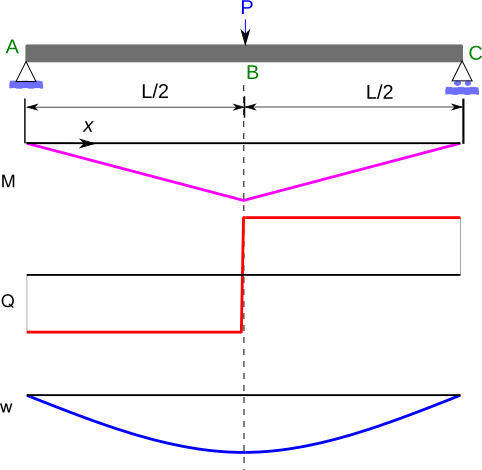
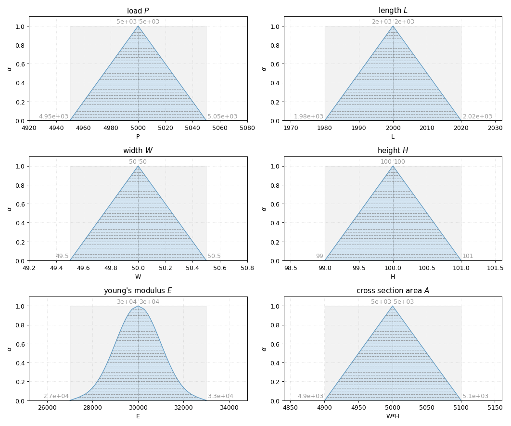
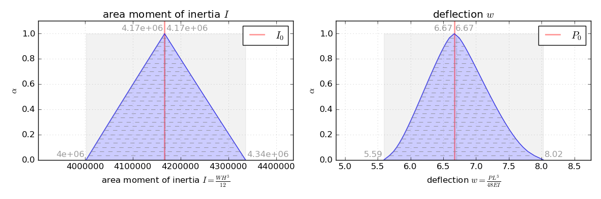

Three-point bending
===================

Simply supported beam with central load
---------------------------------------

What is the maximum deflection of a simple supported beam with central load, if there is an uncertainty of only 1% for all input parameter?
The input parameter are load P, beam length L, beam width W, beam height H and young's modulus E.

.. math::

    P &= 5\, kN \pm 1\%

    L &= 2\, m \pm 1\%

    W &= 50\, mm \pm 1\%

    H &= 100\, mm \pm 1\%

    E &= 30000\, N/mm^2 \pm 1\%

    Three point bending test [`wikipedia.org <https://en.wikipedia.org/wiki/Euler%E2%80%93Bernoulli_beam_theory#Three-point_bending>`_]

.. math::

    w(x) &= {\begin{cases}-{\frac  {Px(4x^{2}-3L^{2})}{48EI}},&{\mbox{for }}0\leq x\leq {\tfrac  {L}{2}}\\{\frac  {P(x-L)(L^{2}-8Lx+4x^{2})}{48EI}},&{\mbox{for }}{\tfrac  {L}{2}}<x\leq L\end{cases}}

    w &= w_{L/2} = \tfrac  {PL^{3}}{48EI}

    A &= WH

    I &= WH^3

Code
^^^^

.. literalinclude:: ssb.py
    :language: python
    :lines: 2-56

Parameter
^^^^^^^^^

    used Parameter

Results
^^^^^^^

    results area moment of inertia ``I`` and deflections ``w``

* :download:`Source code ssb.py<ssb.py>`
