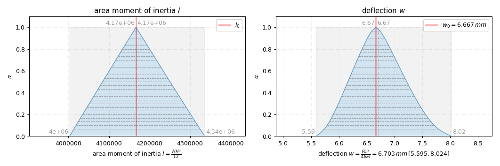

Three-point bending
===================

Simply supported beam with central load
---------------------------------------

.. figure:: SimpSuppBeamPointLoad.svg
    :scale: 20 %
    :alt: three point bending test

    Three point bending test [`wikipedia.org <https://en.wikipedia.org/wiki/Euler%E2%80%93Bernoulli_beam_theory#Three-point_bending>`_]

.. math::

    w(x) &= {\begin{cases}-{\frac  {Px(4x^{2}-3L^{2})}{48EI}},&{\mbox{for }}0\leq x\leq {\tfrac  {L}{2}}\\{\frac  {P(x-L)(L^{2}-8Lx+4x^{2})}{48EI}},&{\mbox{for }}{\tfrac  {L}{2}}<x\leq L\end{cases}}

    w &= w_{L/2} = \tfrac  {PL^{3}}{48EI}

.. literalinclude:: ssb.py
    :language: python
    :lines: 2-56

    Three point bending test results area moment of inertia ``I``, deflections ``w``

