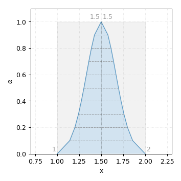
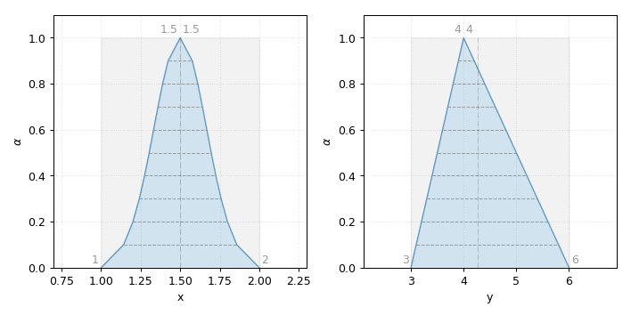
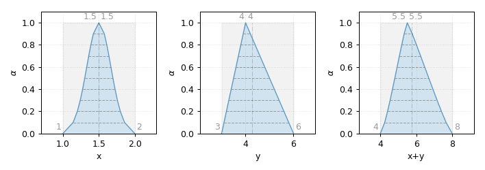
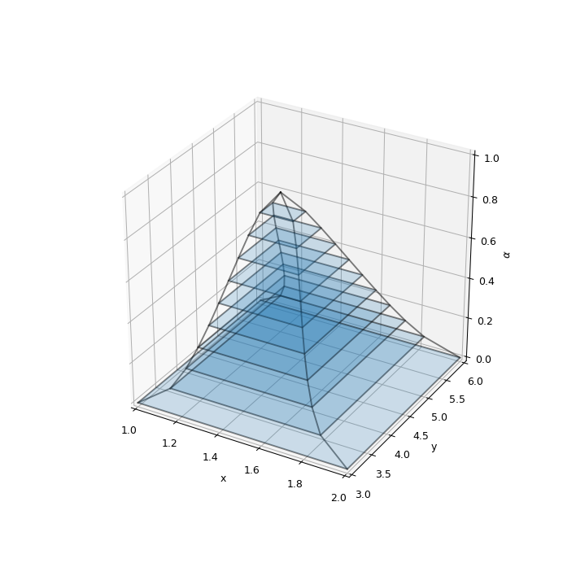
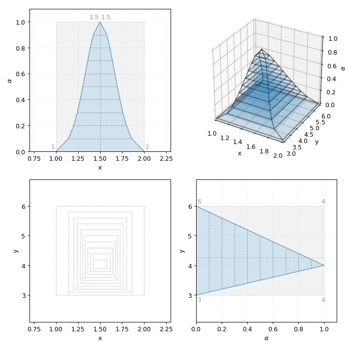

Plots
-----

.. code-block:: python

    import phuzzy
    from phuzzy.mpl import mix_mpl
    import phuzzy.mpl.plots
    x = phuzzy.TruncNorm(alpha0=[1, 2], name="x")
    y = phuzzy.Triangle(alpha0=[3, 6], alpha1=[4], name="y")
    mix_mpl(x)
    x.plot(filepath="FuzzyNumber_plot.png")

    x.plot()

    fig, ax = phuzzy.mpl.plots.plot_xy(x, y)

    fig, ax = phuzzy.mpl.plots.plot_xyz(x, y, x+y)

    fig, ax = phuzzy.mpl.plots.plot_3d(x, y)

    fig, ax = phuzzy.mpl.plots.plot_xy_3d(x, y)
