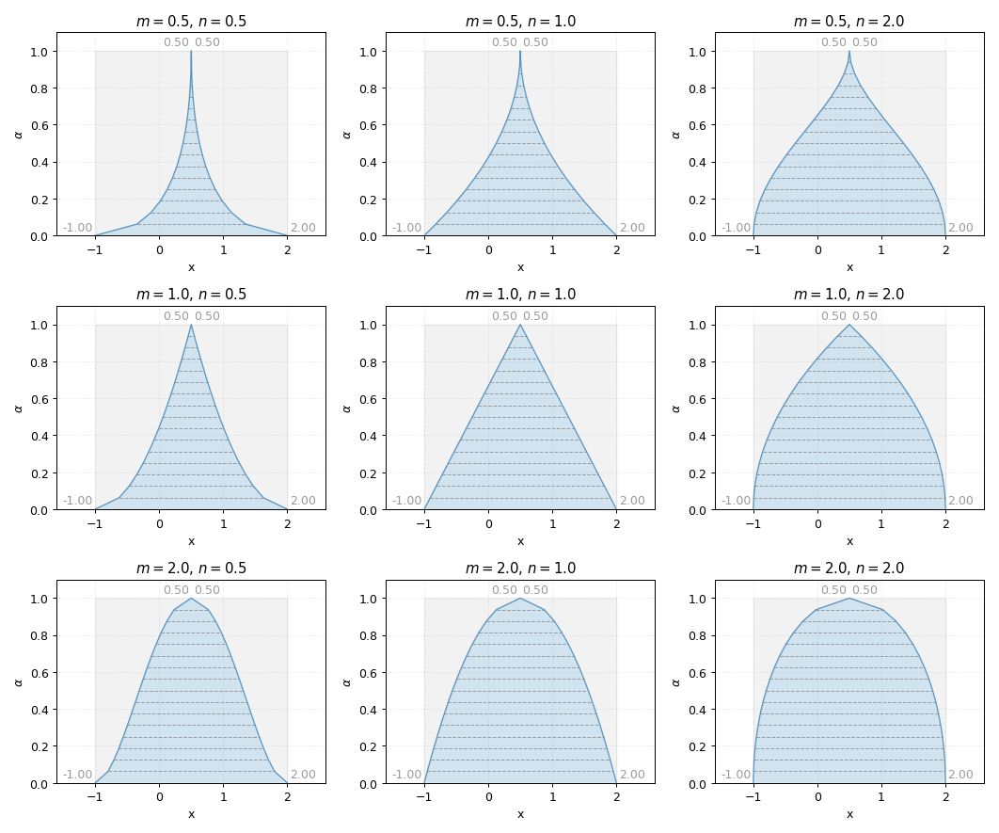
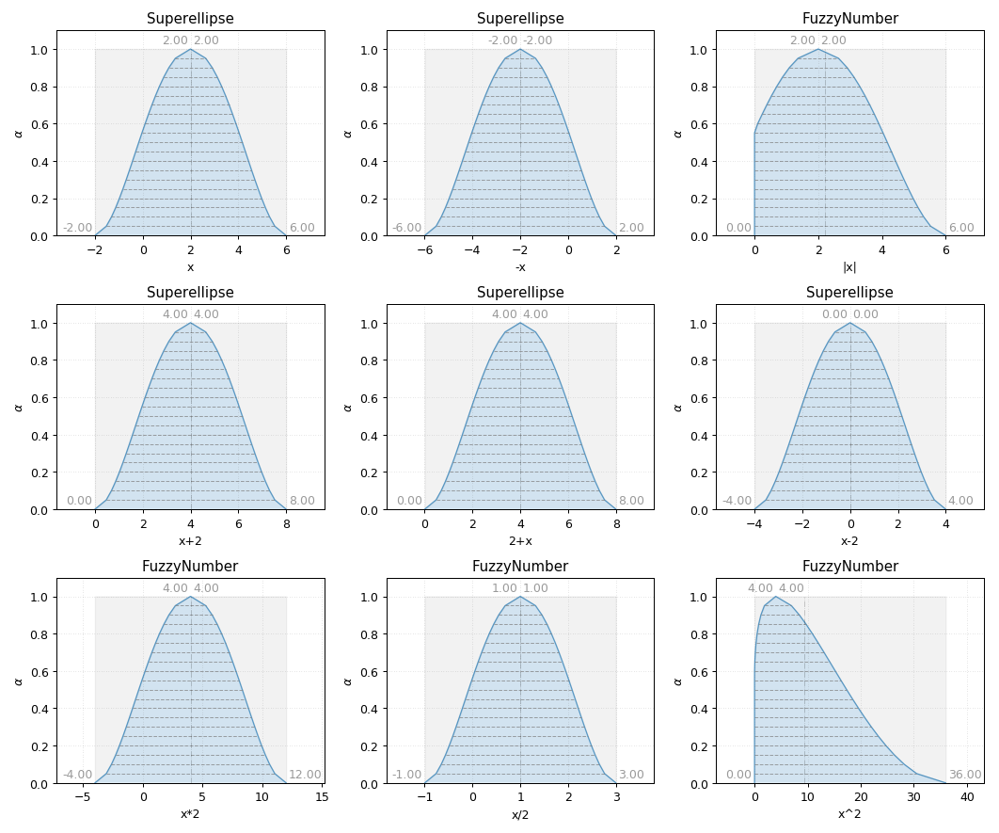

Superellipse
------------

.. code-block:: python
    :linenos:

    import phuzzy.mpl as phm
    se = phm.Superellipse(alpha0=[-1, 2.], alpha1=None, m=1.0, n=.5, number_of_alpha_levels=17)
    se.plot(show=True, filepath="/tmp/superellipse.png", title=True)

.. figure:: superellipse.png
    :scale: 90 %
    :alt: Superellipse fuzzy number

    Superellipse fuzzy number

    Superellipse fuzzy number (variation m, n)

    Superellipse fuzzy number operations
