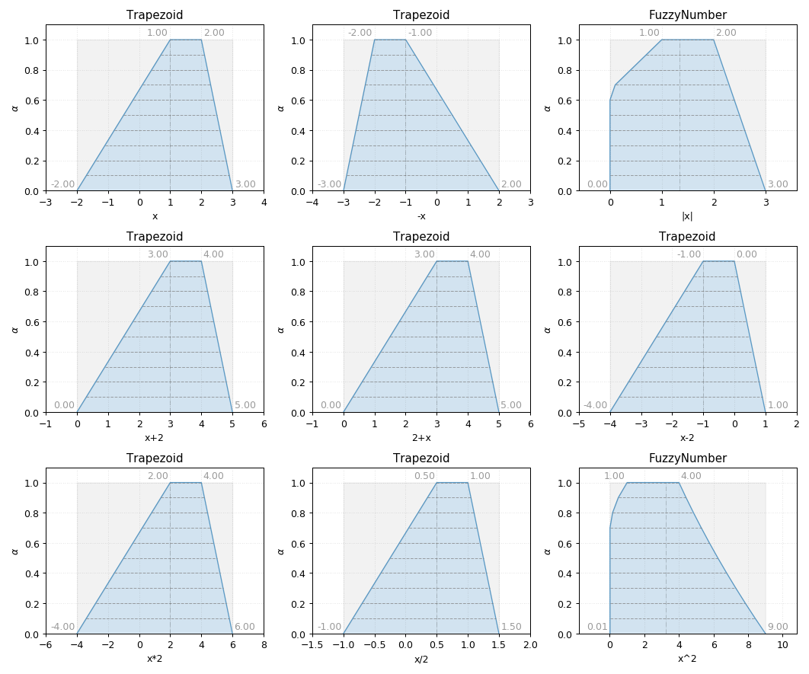

Trapezoid
---------

.. code-block:: python
    :linenos:

    import phuzzy.mpl as phm
    trap = phm.Trapezoid(alpha0=[1, 5], alpha1=[2, 3], number_of_alpha_levels=5)
    trap.plot(show=False, filepath="/tmp/trapezoid.png", title=True)

.. figure:: trapezoid.png
    :scale: 90 %
    :alt: Trapezoid fuzzy number

    Trapezoid fuzzy number

    Trapezoid fuzzy number operations
