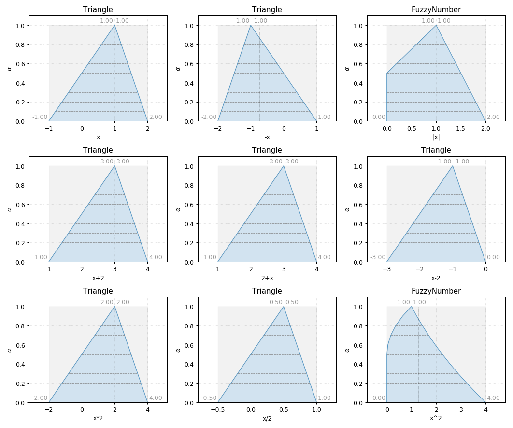

Triangle
--------

.. code-block:: python
    :linenos:

    import phuzzy.mpl as phm

    tri = phm.Triangle(alpha0=[1, 4], alpha1=[2], number_of_alpha_levels=5)
    tri.plot(show=False, filepath="/tmp/triangle.png", title=True)

.. figure:: triangle.png
    :scale: 90 %
    :alt: Triangle fuzzy number

    Triangle fuzzy number

    Triangle fuzzy number operations
