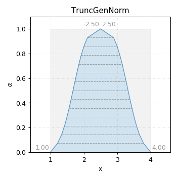
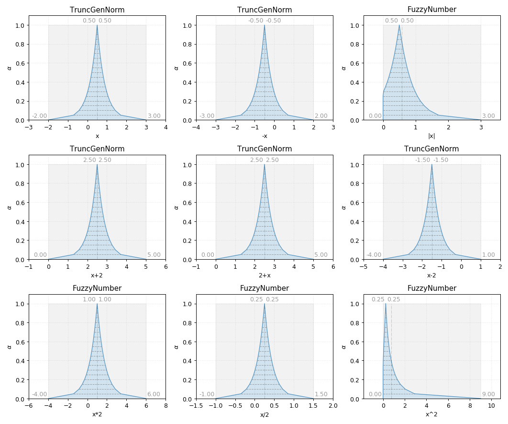

TruncGenNorm
------------

.. code-block:: python
    :linenos:

    import phuzzy.mpl as phm
    tgn = phm.TruncGenNorm(alpha0=[1, 4], alpha1=[2, 3], number_of_alpha_levels=15, beta=3.)
    tgn.plot(show=False, filepath="/tmp/truncgennorm.png", title=True)

    TruncGenNorm fuzzy number

    TruncGenNorm fuzzy number operations
