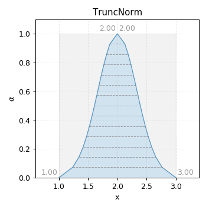
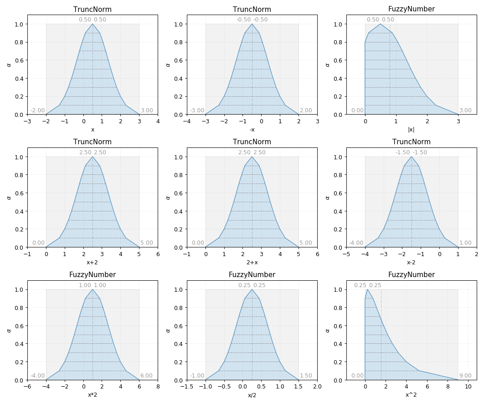

TruncNorm
---------

.. code-block:: python
    :linenos:

    import phuzzy.mpl as phm
    tn = phm.TruncNorm(alpha0=[1, 3], number_of_alpha_levels=15, name="x")
    tn.plot(show=False, filepath="/tmp/truncnorm.png", title=True)

    TruncNorm fuzzy number

    TruncNorm fuzzy number operations
