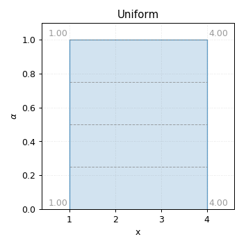
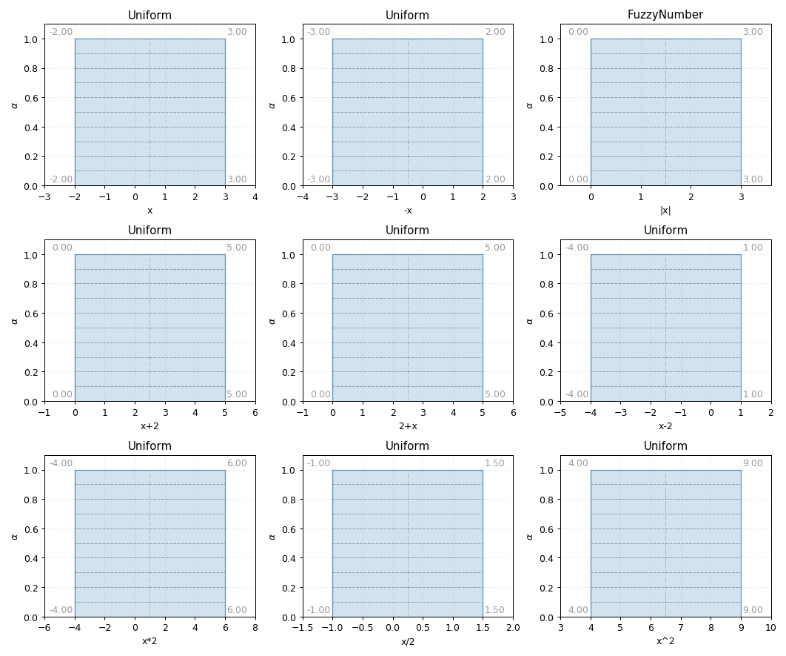

Uniform
-------

.. code-block:: python
    :linenos:

    import phuzzy.mpl as phm
    uni = phm.Uniform(alpha0=[1, 4], number_of_alpha_levels=5, name="x")
    uni.plot(show=True, filepath="/tmp/uniform.png", title=True)

    Uniform fuzzy number

    Uniform fuzzy number operations

