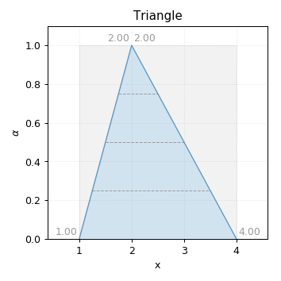
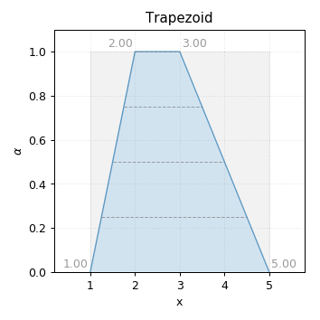

=====
Usage
=====

To use phuzzy in a project:

.. code-block:: python

    import phuzzy
    tn = phuzzy.TruncNorm(alpha0=[2, 3], alpha1=[], number_of_alpha_levels=15, name="t")
    tri = phuzzy.Triangle(alpha0=[1, 4], alpha1=[2], number_of_alpha_levels=5)
    f = tn + tri
    print(f.df)

available shapes
----------------

Uniform
^^^^^^^

.. code-block:: python
    :linenos:

    import phuzzy.mpl as phm
    uni = phm.Uniform(alpha0=[1, 4], number_of_alpha_levels=5, name="x")
    uni.plot(show=True, filepath="/tmp/uniform.png", title=True)

.. figure:: shapes/uniform.png
    :scale: 90 %
    :alt: uniform fuzzy number

    Uniform fuzzy number (this is just an interval)

Triangle
^^^^^^^^

.. code-block:: python
    :linenos:

    import phuzzy.mpl as phm

    tri = phm.Triangle(alpha0=[1, 4], alpha1=[2], number_of_alpha_levels=5)
    tri.plot(show=False, filepath="/tmp/triangle.png", title=True)

    Triangle fuzzy number

Trapezoid
^^^^^^^^^

.. code-block:: python
    :linenos:

    import phuzzy.mpl as phm
    trap = phm.Trapezoid(alpha0=[1, 5], alpha1=[2, 3], number_of_alpha_levels=5)
    trap.plot(show=False, filepath="/tmp/trapezoid.png", title=True)

    Trapezoid fuzzy number

TruncNorm
^^^^^^^^^

.. code-block:: python
    :linenos:

    import phuzzy.mpl as phm
    tn = phm.TruncNorm(alpha0=[1, 3], number_of_alpha_levels=15, name="x")
    tn.plot(show=False, filepath="/tmp/truncnorm.png", title=True)

.. figure:: shapes/truncnorm.png
    :scale: 90 %
    :alt: TruncNorm fuzzy number

    TruncNorm fuzzy number

TruncGenNorm
^^^^^^^^^^^^

.. code-block:: python
    :linenos:

    import phuzzy.mpl as phm
    tgn = phm.TruncGenNorm(alpha0=[1, 4], alpha1=[2, 3], number_of_alpha_levels=15, beta=3.)
    tgn.plot(show=False, filepath="/tmp/truncgennorm.png", title=True)

.. figure:: shapes/truncgennorm.png
    :scale: 90 %
    :alt: TruncGenNorm fuzzy number

    TruncGenNorm fuzzy number

Superellipse
^^^^^^^^^^^^

.. code-block:: python
    :linenos:

    import phuzzy.mpl as phm
    se = phm.Superellipse(alpha0=[-1, 2.], alpha1=None, m=1.0, n=.5, number_of_alpha_levels=17)
    se.plot(show=True, filepath="/tmp/superellipse.png", title=True)

.. figure:: shapes/superellipse.png
    :scale: 90 %
    :alt: Superellipse fuzzy number

    Superellipse fuzzy number

basic operations
----------------

Addition
^^^^^^^^

.. math::

    z = x + y

.. code-block:: python
    :linenos:

    x = phuzzy.Trapezoid(alpha0=[0, 4], alpha1=[2, 3], number_of_alpha_levels=5)
    y = phuzzy.TruncNorm(alpha0=[1, 3], number_of_alpha_levels=15, name="y")
    z = x + y
    z.name = "x+y"

.. figure:: operations/x+y.png
    :scale: 90 %
    :alt: add

    Addition of fuzzy numbers

.. math::

    z = 3 + x

.. code-block:: python
    :linenos:

    x = phuzzy.Trapezoid(alpha0=[0, 4], alpha1=[2, 3], number_of_alpha_levels=5)
    z = 3 + x
    z = x + 3

Substraction
^^^^^^^^^^^^

.. math::

    z = x - y

.. code-block:: python
    :linenos:

    x = phuzzy.Trapezoid(alpha0=[0, 4], alpha1=[2, 3], number_of_alpha_levels=5)
    y = phuzzy.TruncNorm(alpha0=[1, 3], number_of_alpha_levels=15, name="y")
    z = x - y
    z.name = "x-y"

.. figure:: operations/x-y.png
    :scale: 90 %
    :alt: add

    Substraction of fuzzy numbers

.. math::

    y = 3 - x

    z = x - 3

.. code-block:: python
    :linenos:

    x = phuzzy.Trapezoid(alpha0=[0, 4], alpha1=[2, 3], number_of_alpha_levels=5)
    y = 3 - x
    z = x - 3

Multiplication
^^^^^^^^^^^^^^

.. math::

    z = x  y

.. code-block:: python
    :linenos:

    x = phuzzy.Trapezoid(alpha0=[0, 4], alpha1=[2, 3], number_of_alpha_levels=5)
    y = phuzzy.TruncNorm(alpha0=[1, 3], number_of_alpha_levels=15, name="y")
    z = x * y
    z.name = "x*y"

.. figure:: operations/x_mul_y.png
    :scale: 90 %
    :alt: add

    Multiplication of fuzzy numbers

.. math::

    z = 3x

.. code-block:: python
    :linenos:

    x = phuzzy.Trapezoid(alpha0=[0, 4], alpha1=[2, 3], number_of_alpha_levels=5)
    z = 3 * x
    z = x * 3

Division
^^^^^^^^

.. math::

    z = \frac{x}{y}

.. code-block:: python
    :linenos:

    x = phuzzy.Trapezoid(alpha0=[0, 4], alpha1=[2, 3], number_of_alpha_levels=5)
    y = phuzzy.TruncNorm(alpha0=[1, 3], number_of_alpha_levels=15, name="y")
    z = x / y
    z.name = "x/y"

.. figure:: operations/x:y.png
    :scale: 90 %
    :alt: add

    Division of fuzzy numbers

.. math::

    y = 3 / x

    z = x / 3

.. code-block:: python
    :linenos:

    x = phuzzy.Trapezoid(alpha0=[0, 4], alpha1=[2, 3], number_of_alpha_levels=5)
    z = 3 / x
    z = x / 3

Exponentiation
^^^^^^^^^^^^^^

.. math::

    z = x^y

.. code-block:: python
    :linenos:

    x = phuzzy.Trapezoid(alpha0=[0, 4], alpha1=[2, 3], number_of_alpha_levels=5)
    y = phuzzy.TruncNorm(alpha0=[1, 3], number_of_alpha_levels=15, name="y")
    z = x ** y
    z.name = "x^y"

.. figure:: operations/x_pow_y.png
    :scale: 90 %
    :alt: add

    Power operation with fuzzy numbers

.. math::

    z = x^3

.. code-block:: python
    :linenos:

    x = phuzzy.Trapezoid(alpha0=[0, 4], alpha1=[2, 3], number_of_alpha_levels=5)
    z = x**3

Negation
^^^^^^^^

.. math::

    z = -x

.. code-block:: python
    :linenos:

    x = phuzzy.Trapezoid(alpha0=[0, 4], alpha1=[2, 3], number_of_alpha_levels=5)
    z = -x

Absolute value
^^^^^^^^^^^^^^

.. math::

    z = |x|

.. code-block:: python
    :linenos:

    x = phuzzy.Trapezoid(alpha0=[-1, 4], alpha1=[2, 3], number_of_alpha_levels=5)
    z = abs(x)
    z = x.abs()
